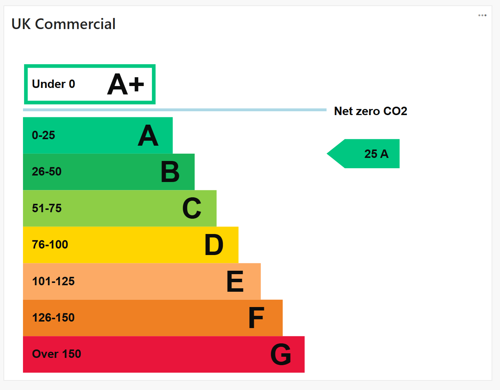
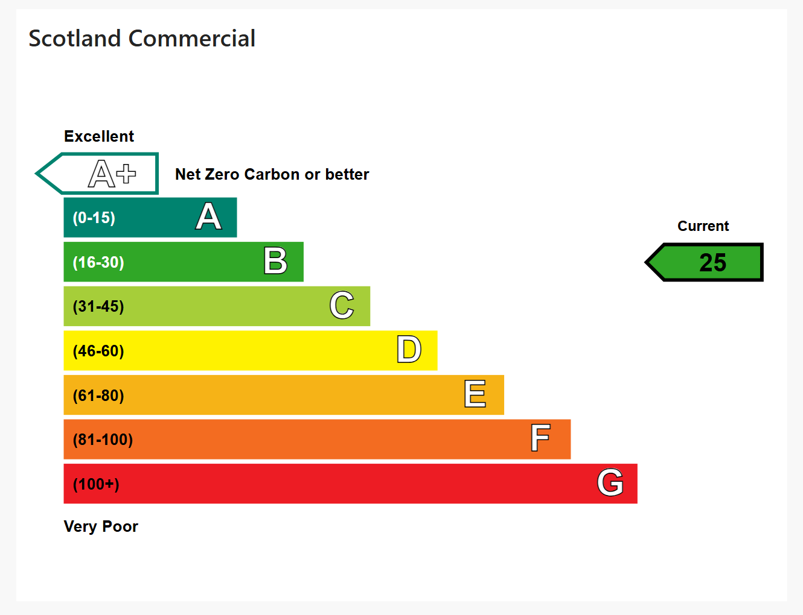
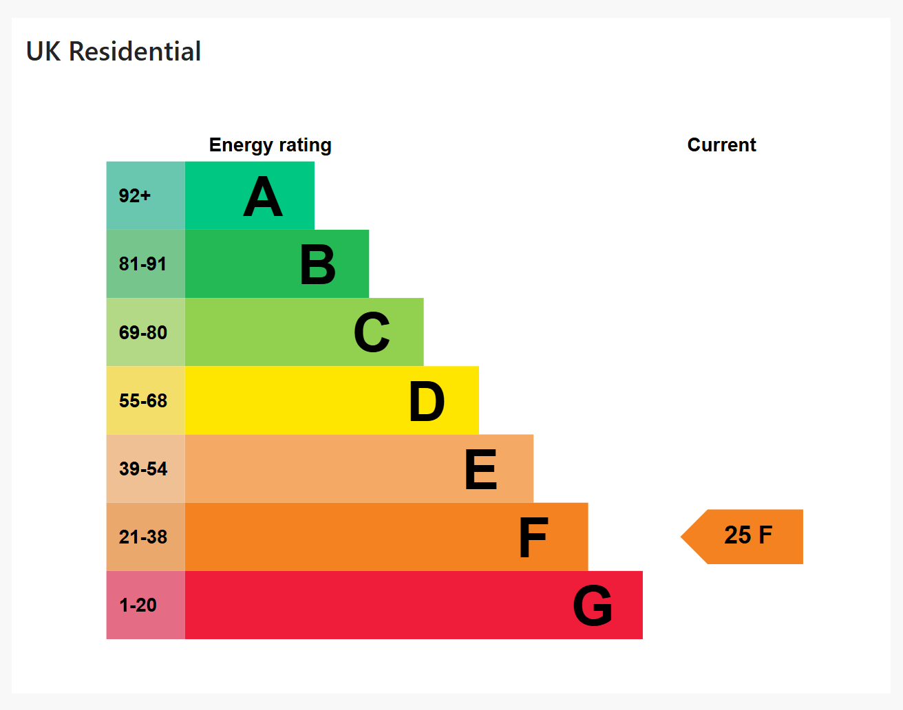
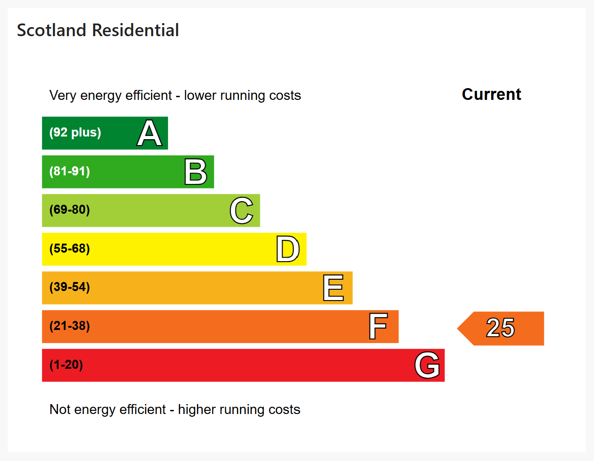

# Power BI EPC SVG UDFs

Recreate official UK EPC (Energy Performance Certificate) rating graphics directly inside Power BI using pure DAX and inline SVG.

This repository contains a collection of Power BI DAX User Defined Functions (UDFs) that generate EPC visuals matching the style of official UK and Scottish EPC certificates, without requiring:

- External images
- Custom visuals
- HTML rendering
- Web requests

Everything is generated dynamically using native Power BI functionality.

---

## Included Functions

| Function | Description |
|---|---|
| `MartynBooth.EPC.CommercialUKSVG()` | UK commercial EPC visual |
| `MartynBooth.EPC.CommercialScotlandSVG()` | Scottish commercial EPC visual |
| `MartynBooth.EPC.ResidentialUKSVG()` | UK residential EPC visual |
| `MartynBooth.EPC.ResidentialScotlandSVG()` | Scottish residential EPC visual |

---

## Example Visuals

### UK Commercial EPC



---

### Scotland Commercial EPC



---

### UK Residential EPC



---

### Scotland Residential EPC



---

## Features

- Pure DAX + SVG
- No external dependencies
- Dynamic colour coding
- Dynamic EPC grade calculation
- Works in tables, matrices and cards
- SVG generated entirely at query time
- Closely matches official EPC styling
- Separate UK and Scottish implementations
- Separate residential and commercial implementations

---

## Why Separate Functions?

Although EPC visuals look similar, the underlying systems differ significantly between:

- UK commercial
- Scottish commercial
- UK residential
- Scottish residential

Differences include:

- Score direction
- Grade thresholds
- Layout
- Colour palettes
- Typography
- Marker styling
- Scale structure

Keeping each implementation separate makes the code:

- Easier to maintain
- Easier to debug
- Easier to extend
- Easier to keep visually accurate

---

## Installation

### Step 1 — Open TMDL View

In Power BI Desktop:

```text
Model View → TMDL View
```

---

### Step 2 — Paste Function

Open the relevant `.tmdl` file from the `/tmdl` folder and paste it into TMDL View.

Example:

```text
/tmdl/ResidentialUK.tmdl
```

---

### Step 3 — Apply Changes

Click:

```text
Apply
```

The function will now be available in your semantic model.

---

## Usage

Example measure:

```DAX
EPC SVG =
MartynBooth.EPC.ResidentialUKSVG ( [EPC Score] )
```

Then set the data category to:

```text
Image URL
```

The SVG will render automatically inside Power BI visuals.

---

## Example Dataset

| Property | EPC Score |
| --- | --- |
| Office A | 78 |
| Warehouse B | 42 |
| Flat C | 93 |
| Retail Unit D | 18 |

---

## Use Cases

These visuals are particularly useful for:

- Property analytics
- Commercial real estate dashboards
- ESG reporting
- Sustainability reporting
- Housing associations
- Facilities management
- EPC compliance tracking
- Energy efficiency analysis
- Local authority reporting

---

## Technical Notes

### SVG Rendering

The functions return SVGs encoded as:

```text
data:image/svg+xml;utf8,
```

This allows Power BI to render the graphic natively without requiring:

- Base64 encoding
- External hosting
- HTML visuals

---

### Compatibility

Tested with:

- Power BI Desktop
- TMDL View
- DAX UDFs

Requires:

- A Power BI version supporting DAX User Defined Functions

---

## Repository Structure

```text
/tmdl
    CommercialUK.tmdl
    CommercialScotland.tmdl
    ResidentialUK.tmdl
    ResidentialScotland.tmdl

/examples
    uk_commercial_epc.png
    scotland_commercialepc.png
    uk_residential_epc.png
    scotland_residential_epc.png

README.md
LICENSE
```

---

---

## Disclaimer

These visuals are unofficial recreations intended for reporting and analytical use inside Power BI.

EPC methodologies and certificate designs may change over time.

---

## License

MIT License

Feel free to use, modify and adapt these functions in your own Power BI projects.
